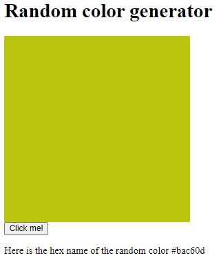

#Random color generator

This app was build with react.js and is giving a random color.

You can see the color in a square when pressing the "Click me!" button.

The name of the color is provided at the bottom: "Here the hex name of the random color #c7f490".
